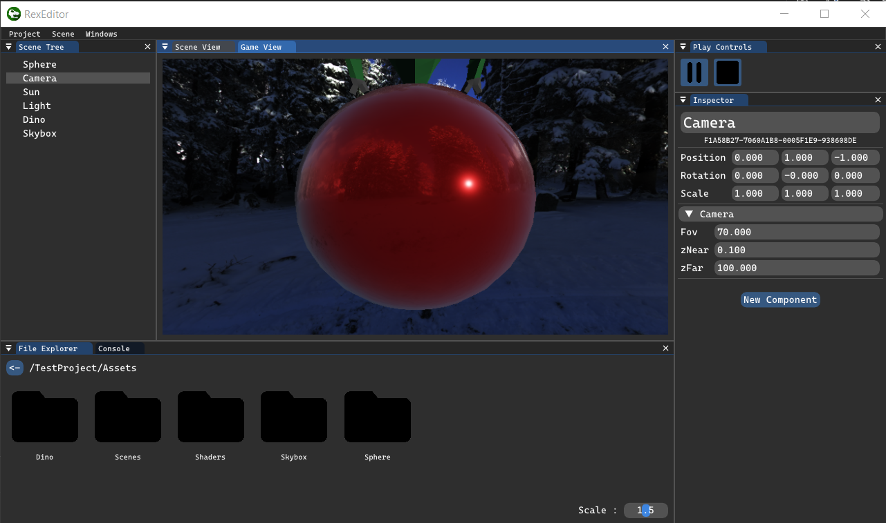

# RexGameEngine

## Why ?
I started this engine in October of 2022 as a learning exercise. I tried to touch on a lot of different aspects of game engine design, such as rendering, entity systems, asset management systems, and UI design. [Screenshots bellow](#screenshots)

## Key Features :
- The project is split in two main sections : an engine and an editor
- The engine is completely isolated from the editor
##### Engine :
- Material system and PBR shader support, with image-based lighting
- Assets management system with per asset metadata
- The scenes are split in Entities, each entity is made up of components
- Enities have a hierarchy, with a parent and childs
##### Editor :
- Scenes and assets are grouped in projects
- Scene editing : add/remove entities (SceneTree)
- Inspect and change the components of each entity (Inspector)
- Edit asset metadata (e.g. properties of a material) (Inspector)
- Console
- Play mode (changes made in play mode are undone after a play session)

## How ?
All of the code for this engine was produced by me, except for these libraries I used :
- [cereal](https://uscilab.github.io/cereal/) is used in the asset management system to store metadata related to each asset
- the entity and component management is based on [entt](https://github.com/skypjack/entt)
- [GLFW](https://www.glfw.org/) is used to provide the window and the inputs
- All of the vector and matrix math is done by [glm](https://glm.g-truc.net/0.9.9/) under the hood
- [stb_image](https://github.com/nothings/stb) is used to load textures
- the UI system of the editor uses [Dear ImGui](https://github.com/ocornut/imgui)

## Screenshots

## Coming next
- C# scripting : custom components, asset types and Editor UIs
