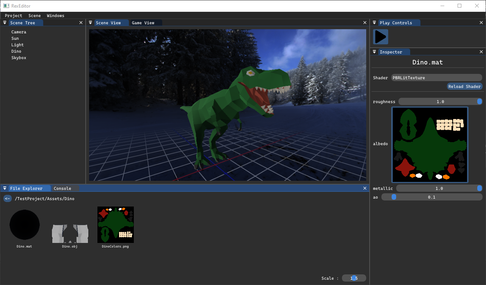

# RexGameEngine
**This project is split in two main sections :**  
`RexEngine` is a small 3D game engine.  
`RexEditor` is a level and project editor made for RexEngine.  

### Main features of the engine
- PBR (physically based rendering) workflow
- Material system for shaders
- Assets management system with per asset metadata
- ECS based scenes
- Event system
### Main features of the editor
- Scenes and assets are grouped in projects
- Scene editing : add/remove entities (SceneTree)
- Inspect and change the components of each entity (Inspector)
- Edit asset metadata (e.g. properties of a material) (Inspector)
- Console
- Play mode (changes made in play mode are undone after a play session)

### Coming next
- C# scripting : custom components, asset types and Editor UIs
